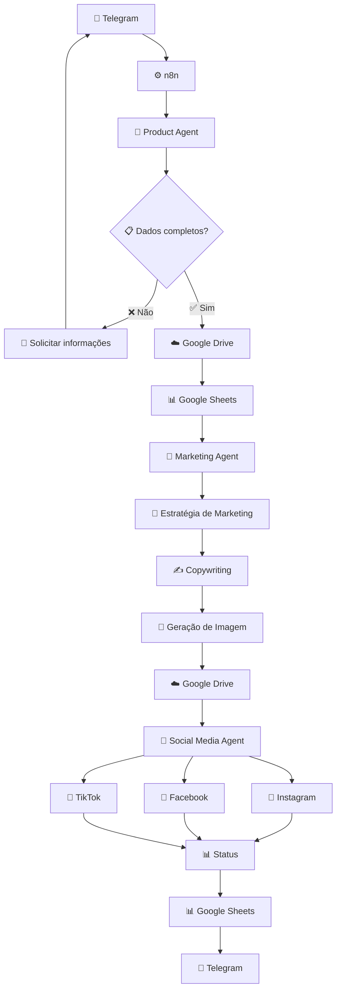

# 🤖 Autonomous AI Marketing System

> 🚀 **Plataforma Multiagente Autônoma para Automação de Marketing com Inteligência Artificial**

Sistema desenvolvido para automatizar o processo de **recebimento de produtos, análise de informações, criação de campanhas, geração de conteúdo com IA e publicação em redes sociais**, utilizando uma arquitetura baseada em agentes inteligentes.

---

## 🧠 Visão Geral

O **Autonomous AI Marketing System** utiliza múltiplos agentes especializados para transformar uma simples **foto de produto enviada pelo Telegram** em uma campanha de marketing pronta para divulgação.

O sistema combina:

* 🧠 **LLMs**
* 🤖 **Multi-Agent Systems**
* 🔗 **LangChain**
* 🕸️ **LangGraph**
* ⚙️ **n8n**
* 🐍 **Python**
* 💬 **Telegram**
* ☁️ **Google Drive**
* 📊 **Google Sheets**
* 🎨 **IA Generativa**
* 📱 **Instagram**
* 📘 **Facebook**
* 🎵 **TikTok**
* 🔌 **APIs**

O objetivo é criar uma infraestrutura capaz de executar o processo com **mínima intervenção humana**, mantendo controle de estado, histórico, erros e resultados.

---

# 🏗️ Arquitetura



---

# 🤖 Agentes de IA

## 📦 1. Product Agent

Responsável pelo cadastro e processamento inicial do produto.

### Funções

* 📷 Receber imagem do produto
* 🔍 Analisar a imagem
* 📝 Extrair informações
* 🧠 Utilizar modelo multimodal
* ✅ Validar dados
* ❓ Identificar informações ausentes
* 💬 Solicitar informações ao usuário
* 💾 Salvar os dados do produto

### Informações processadas

```text
Nome
Descrição
Cor
Tamanho
Valor de atacado
Valor de varejo
Imagem original
```

---

# 🧠 2. LangGraph — Controle de Estado

O **LangGraph** é utilizado para controlar o fluxo e o estado das interações entre o usuário e os agentes.

Exemplo:

```text
Produto recebido
      ↓
Análise da imagem
      ↓
Validação
      ↓
Falta tamanho
      ↓
Pergunta ao usuário
      ↓
⏳ Aguardando resposta
      ↓
Usuário responde
      ↓
Estado recuperado
      ↓
Produto atualizado
      ↓
Continua o workflow
```

Isso permite que o sistema saiba:

* 📌 Qual produto está sendo processado
* 📌 Qual informação está faltando
* 📌 Qual etapa está sendo executada
* 📌 Qual foi a última interação
* 📌 Qual agente deve executar a próxima tarefa

---

# 📣 3. Marketing Agent

Após o produto estar completo, ele é encaminhado para o agente de marketing.

### Responsabilidades

🎯 Criar estratégia de campanha
✍️ Criar textos promocionais
🧲 Criar headlines
#️⃣ Criar hashtags
🎨 Criar prompts para geração de imagens
📱 Adaptar conteúdo para diferentes plataformas

Exemplo:

```json
{
  "campaign_id": "C000001",
  "product_id": "P000001",
  "headline": "Seu novo estilo começa aqui!",
  "marketing_concept": "Campanha focada em moda e conversão",
  "image_prompt": "Criar uma composição comercial...",
  "captions": {
    "instagram": "...",
    "facebook": "...",
    "tiktok": "..."
  },
  "hashtags": [
    "#moda",
    "#novidades",
    "#oferta"
  ]
}
```

---

# 🎨 4. AI Image Generation

O sistema utiliza IA generativa para criar imagens de marketing a partir da imagem original do produto.

### Fluxo

```text
📷 Imagem original
        ↓
🧠 Marketing Agent
        ↓
📝 Image Prompt
        ↓
🎨 IA Generativa
        ↓
🖼️ Imagem promocional
        ↓
☁️ Google Drive
```

As imagens geradas são armazenadas na pasta:

```text
📁 fotos geradas
```

Enquanto as imagens originais são armazenadas em:

```text
📁 produtos novos
```

---

# 📱 5. Social Media Agent

Responsável pela distribuição das campanhas.

```text
            📣 Campaign
                │
       ┌────────┼────────┐
       ↓        ↓        ↓
  📸 Instagram 📘 Facebook 🎵 TikTok
```

Cada plataforma possui seu próprio status.

Exemplo:

```json
{
  "instagram_status": "published",
  "facebook_status": "published",
  "tiktok_status": "failed"
}
```

Dessa forma, uma falha em uma plataforma não interrompe necessariamente as demais.

---

# ⚙️ n8n — Orquestração

O **n8n** funciona como camada externa de automação e integração.

### Workflows planejados

| Workflow              | Responsabilidade        |
| --------------------- | ----------------------- |
| `01_telegram_product` | 📱 Receber produtos     |
| `02_product_storage`  | 💾 Armazenar dados      |
| `03_marketing`        | 📣 Criar campanha       |
| `04_social_media`     | 📱 Publicar conteúdo    |
| `05_daily_campaign`   | ⏰ Campanhas automáticas |
| `06_error_handler`    | 🚨 Tratamento de erros  |
| `07_monitoring`       | 📊 Monitoramento        |

---

# ⏰ Automação Diária

Todos os dias às **08:00**, o sistema verifica se houve um novo produto no dia anterior.

```text
             ⏰ 08:00
                ↓
      🔍 Verificar produtos
                ↓
        ┌───────┴───────┐
        ↓               ↓
      Existe?          Não?
        ↓               ↓
    Nova campanha    Último produto
        ↓               ↓
        └───────┬───────┘
                ↓
        🧠 Marketing Agent
                ↓
        🎨 Nova imagem
                ↓
        📱 Redes sociais
```

Quando não existe um novo produto, o sistema pode utilizar o último produto cadastrado para criar uma **nova campanha**, utilizando uma abordagem diferente.

### 🛡️ Controle de duplicidade

O sistema deve verificar:

* `product_id`
* `campaign_id`
* histórico de campanhas
* histórico de publicações
* plataforma
* data da publicação

Isso evita a criação acidental de campanhas duplicadas.

---

# 🗂️ Estrutura do Projeto

```text
autonomous-ai-marketing/
│
├── 📄 README.md
├── 🔐 .env.example
├── 🚫 .gitignore
├── 📦 requirements.txt
│
├── backend/
│
├── agents/
│   │
│   ├── product_agent/
│   │   ├── prompts/
│   │   ├── tools/
│   │   └── graph/
│   │
│   ├── marketing_agent/
│   │   ├── prompts/
│   │   ├── tools/
│   │   └── graph/
│   │
│   └── social_agent/
│       ├── prompts/
│       ├── tools/
│       └── graph/
│
├── graphs/
│
├── tools/
│
├── schemas/
│
├── services/
│   ├── telegram/
│   ├── google_drive/
│   ├── google_sheets/
│   ├── image_generation/
│   └── social_media/
│
├── database/
│
├── config/
│
├── logs/
│
├── tests/
│
└── n8n/
    └── workflows/
```

---

# 🗃️ Estrutura de Dados

## 📦 Product

```json
{
  "product_id": "P000001",
  "data_cadastro": "2026-09-17",
  "nome": "Camisa feminina",
  "descricao": "Camisa feminina casual",
  "cor": "Azul",
  "tamanho": "M",
  "valor_atacado": 35.00,
  "valor_varejo": 59.90,
  "drive_original_url": "...",
  "drive_marketing_url": "...",
  "campaign_id": "C000001",
  "instagram_status": "published",
  "facebook_status": "published",
  "tiktok_status": "published",
  "status": "completed"
}
```

---

# 🔄 Comunicação entre Agentes

Os agentes devem utilizar **dados estruturados**, evitando depender de texto livre.

Exemplo:

```text
Product Agent
      ↓
Product Schema
      ↓
Marketing Agent
      ↓
Campaign Schema
      ↓
Social Media Agent
      ↓
Publication Result
```

Isso facilita:

* 🔧 manutenção
* 🧪 testes
* 📈 escalabilidade
* 🐛 debugging
* 🔄 reutilização
* 🔌 integração com novas ferramentas

---

# 🛡️ Confiabilidade

O sistema foi projetado considerando mecanismos para execução confiável.

### 🔁 Retry

Falhas temporárias podem ser tratadas utilizando:

```text
Tentativa 1
   ↓
Falhou
   ↓
Aguardar
   ↓
Tentativa 2
   ↓
Falhou
   ↓
Aguardar
   ↓
Tentativa 3
   ↓
Erro definitivo
```

### 🚨 Error Handling

Cada etapa deve possuir tratamento de erros.

```text
Agent
 ↓
Tool/API
 ↓
 ┌──────────────┐
 │              │
Sucesso       Erro
 │              │
 ↓              ↓
Continua     Retry
                ↓
             Fallback
                ↓
              Log
```

---

# 🔐 Segurança

Informações sensíveis **não devem ser armazenadas diretamente no código**.

Utilizar:

```env
OPENAI_API_KEY=
TELEGRAM_BOT_TOKEN=
GOOGLE_CLIENT_ID=
GOOGLE_CLIENT_SECRET=
META_ACCESS_TOKEN=
TIKTOK_ACCESS_TOKEN=
```

As credenciais devem ser armazenadas utilizando:

* 🔐 `.env`
* 🔑 Credentials do n8n
* 🔒 Secret Manager
* 🚫 Nunca versionar chaves no Git

---

# 🧩 Tecnologias

| Tecnologia           | Utilização                    |
| -------------------- | ----------------------------- |
| 🐍 **Python**        | Backend e agentes             |
| 🧠 **LangChain**     | LLMs, tools e agentes         |
| 🕸️ **LangGraph**    | Estado e workflows de agentes |
| ⚙️ **n8n**           | Orquestração e automação      |
| 💬 **Telegram**      | Interface com usuário         |
| ☁️ **Google Drive**  | Armazenamento de imagens      |
| 📊 **Google Sheets** | Banco inicial de dados        |
| 🎨 **IA Generativa** | Geração de imagens            |
| 📸 **Instagram API** | Publicação                    |
| 📘 **Facebook API**  | Publicação                    |
| 🎵 **TikTok API**    | Publicação                    |

---

# 🧱 Princípios de Arquitetura

O projeto segue alguns princípios fundamentais:

### 🧩 Modularidade

Cada agente possui uma responsabilidade específica.

### 🔌 Baixo acoplamento

Agentes e serviços podem ser substituídos sem reconstruir todo o sistema.

### 📦 Dados estruturados

Comunicação entre componentes utilizando schemas bem definidos.

### 🧠 Persistência de estado

O sistema consegue continuar uma execução após uma interação do usuário.

### 🔁 Idempotência

Operações críticas devem evitar duplicações.

### 🚨 Resiliência

Falhas de APIs e serviços externos devem ser tratadas.

### 📊 Observabilidade

Logs e status devem permitir identificar problemas rapidamente.

### 👤 Human-in-the-loop

O usuário pode intervir quando necessário através do Telegram.

---

# 👤 Human-in-the-Loop

Apesar de ser projetado para autonomia, o sistema pode permitir comandos manuais.

Exemplos:

```text
/novo_produto
/status
/aprovar
/rejeitar
/republicar
/pausar
/continuar
/campanhas
```

Isso permite combinar:

> 🤖 **Autonomia + 👤 Controle humano**

---

# 🗄️ Evolução do Banco de Dados

Inicialmente:

```text
Google Sheets
```

Futuramente:

```text
Google Sheets
      ↓
PostgreSQL
```

A arquitetura deve utilizar interfaces como:

```text
ProductRepository
CampaignRepository
SocialPostRepository
AgentStateRepository
LogRepository
```

Isso permite migrar o armazenamento sem alterar significativamente a lógica dos agentes.

---

# 🚀 Roadmap

## ✅ Fase 0 — Arquitetura

* [x] Definição da arquitetura
* [x] Definição dos agentes
* [x] Definição do fluxo
* [x] Definição dos schemas

## 🔨 Fase 1 — Infraestrutura

* [ ] Configuração Python
* [ ] Configuração n8n
* [ ] Estrutura do projeto
* [ ] Variáveis de ambiente

## 📱 Fase 2 — Product Agent

* [ ] Telegram
* [ ] Recebimento de imagem
* [ ] Análise multimodal
* [ ] Validação de dados
* [ ] Solicitação de informações

## 🧠 Fase 3 — LangGraph

* [ ] State
* [ ] Memory
* [ ] Checkpoints
* [ ] Human-in-the-loop

## ☁️ Fase 4 — Storage

* [ ] Google Drive
* [ ] Google Sheets
* [ ] Links dos arquivos

## 📦 Fase 5 — MVP

* [ ] Cadastro completo
* [ ] Persistência
* [ ] Pipeline completo

## 📣 Fase 6 — Marketing Agent

* [ ] Estratégia
* [ ] Copywriting
* [ ] Hashtags
* [ ] Prompts

## 🎨 Fase 7 — Image Generation

* [ ] Integração com modelo
* [ ] Geração de imagens
* [ ] Armazenamento

## 📱 Fase 8 — Social Media

* [ ] Instagram
* [ ] Facebook
* [ ] TikTok
* [ ] Status individual

## ⏰ Fase 9 — Autonomia

* [ ] Workflow 08:00
* [ ] Novas campanhas
* [ ] Controle de duplicidade

## 🛡️ Fase 10 — Confiabilidade

* [ ] Retry
* [ ] Logs
* [ ] Monitoramento
* [ ] Error handling

## 👤 Fase 11 — Controle Humano

* [ ] Aprovação
* [ ] Pausa
* [ ] Reexecução
* [ ] Status via Telegram

## 🧪 Fase 12 — Testes

* [ ] Unit tests
* [ ] Integration tests
* [ ] End-to-end tests

## 🗄️ Fase 13 — PostgreSQL

* [ ] Banco relacional
* [ ] Migração dos dados
* [ ] Persistência de estados

## 🎬 Fase 14 — Expansão

* [ ] Video Agent
* [ ] Analytics Agent
* [ ] Customer Service Agent
* [ ] Inventory Agent
* [ ] Pricing Agent

---

# 🔮 Visão Futura

A arquitetura foi pensada para evoluir de um sistema de marketing para uma verdadeira **plataforma de agentes autônomos**.

```text
                    🤖 AI ORCHESTRATOR
                           │
        ┌──────────────────┼──────────────────┐
        │                  │                  │
        ↓                  ↓                  ↓
   📦 Product          📣 Marketing       📱 Social
     Agent               Agent             Agent
        │                  │                  │
        └──────────────────┼──────────────────┘
                           │
              ┌────────────┼────────────┐
              ↓            ↓            ↓
          🎬 Video     📊 Analytics   💬 Customer
            Agent         Agent        Service
              │            │            │
              └────────────┼────────────┘
                           ↓
                    🧠 AI Ecosystem
```

---

# 💡 Exemplo de Execução

### 1️⃣ Usuário envia uma foto

```text
📱 Telegram
    ↓
📷 produto.jpg
```

### 2️⃣ Product Agent analisa

```text
Nome: Camisa feminina
Cor: Azul
Tamanho: ❓
Atacado: R$ 35,00
Varejo: R$ 59,90
```

### 3️⃣ Agente solicita informação

```text
🤖 Qual é o tamanho da camisa?
```

### 4️⃣ Usuário responde

```text
M
```

### 5️⃣ Produto é salvo

```text
☁️ Google Drive
📊 Google Sheets
```

### 6️⃣ Marketing Agent cria campanha

```text
🧠 Estratégia
✍️ Copy
#️⃣ Hashtags
🎨 Prompt
```

### 7️⃣ IA gera imagem

```text
📷 Produto original
        ↓
🎨 IA Generativa
        ↓
🖼️ Marketing Image
```

### 8️⃣ Social Media Agent publica

```text
📸 Instagram  ✅
📘 Facebook   ✅
🎵 TikTok     ✅
```

### 9️⃣ Sistema registra resultado

```text
📊 Google Sheets
        ↓
💬 Telegram
        ↓
"Campanha concluída com sucesso! 🚀"
```

---

# 📈 Objetivo do Projeto

O objetivo final é construir um sistema capaz de:

```text
📷 Receber produto
       ↓
🧠 Entender produto
       ↓
📋 Organizar informações
       ↓
📣 Criar estratégia
       ↓
✍️ Criar conteúdo
       ↓
🎨 Gerar imagens
       ↓
🎬 Futuramente gerar vídeos
       ↓
📱 Publicar
       ↓
📊 Registrar resultados
       ↓
🔄 Criar novas campanhas
       ↓
🤖 Operar de forma autônoma
```

---

# 🌟 Diferenciais Técnicos

Este projeto combina diferentes conceitos de Engenharia de IA:

* 🤖 **Multi-Agent Architecture**
* 🧠 **LLM Orchestration**
* 🕸️ **Stateful Agent Workflows**
* 🔗 **Tool Calling**
* 👁️ **Multimodal AI**
* 🎨 **Generative AI**
* 🔌 **API Integration**
* ⚙️ **Workflow Automation**
* 🔄 **Retry & Recovery**
* 🛡️ **Idempotency**
* 📊 **Observability**
* 👤 **Human-in-the-loop**
* 📈 **Scalable Architecture**

---

# 📚 Conceitos Utilizados

```text
Artificial Intelligence
        ↓
Large Language Models
        ↓
AI Agents
        ↓
Multi-Agent Systems
        ↓
LangChain
        ↓
LangGraph
        ↓
Workflow Automation
        ↓
API Integration
        ↓
Generative AI
```

---

# 🎯 Status

🚧 **Em desenvolvimento**

O projeto está sendo desenvolvido de forma incremental, começando pelo pipeline de produtos e evoluindo posteriormente para marketing, geração de imagens, publicação em redes sociais e novos agentes especializados.

---

# 👨‍💻 Projeto

**Autonomous AI Marketing System**

> Construindo uma arquitetura de agentes de IA capaz de transformar processos de marketing em workflows inteligentes, automatizados e escaláveis. 🤖🚀

---

⭐ **Projeto desenvolvido para estudo e aplicação prática de Inteligência Artificial, Multi-Agent Systems, automação e integração de APIs.**
